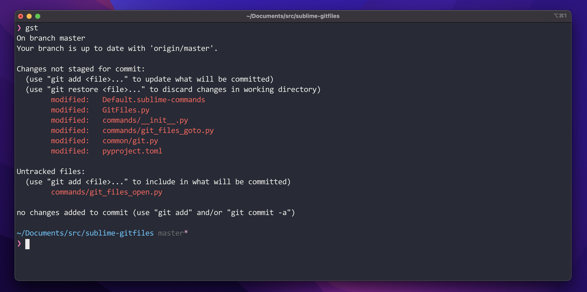
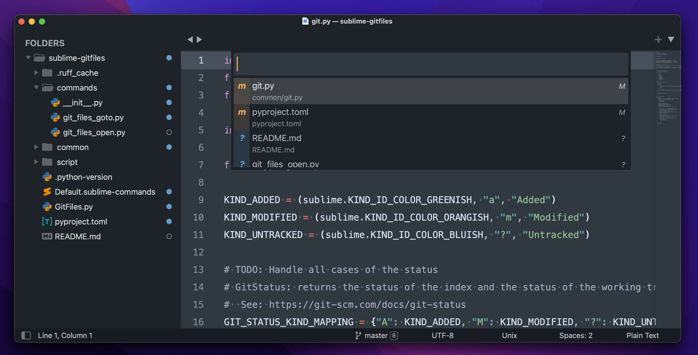
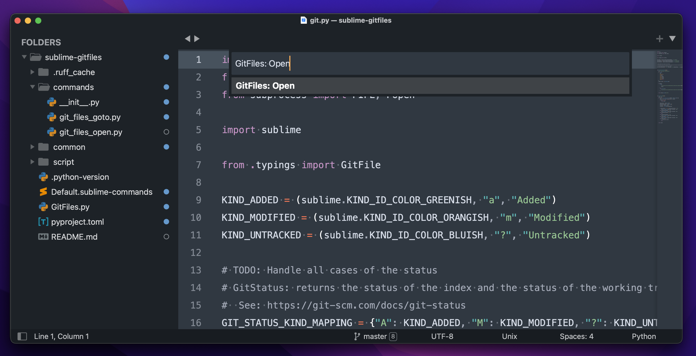
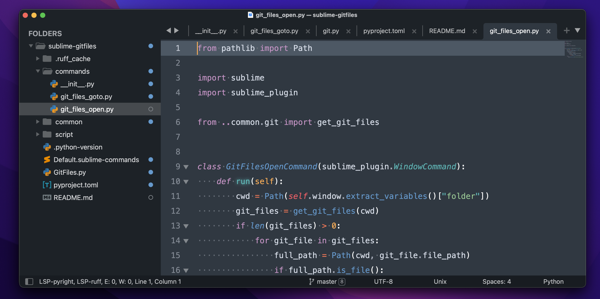

# GitFiles

A sublime plugin to easily open the changed files based on `git status`.

For example:

Using **GitFiles: Goto** command, you can goto the modified and untracked files.

Using **GitFiles: Open** command, you can open all the modified and untracked files.

